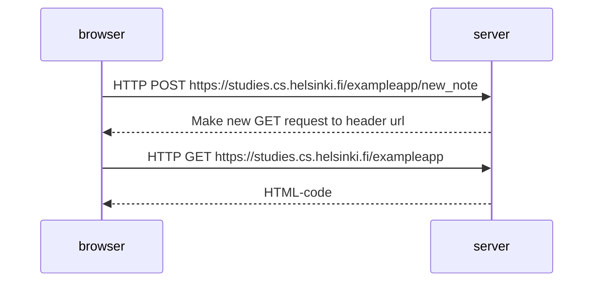
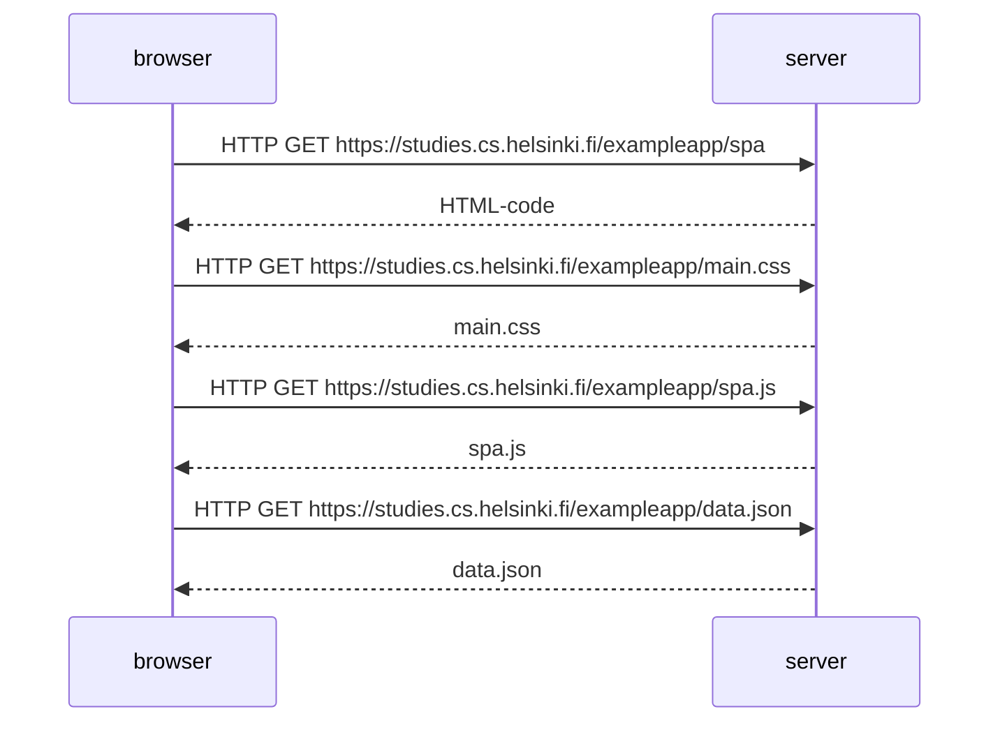
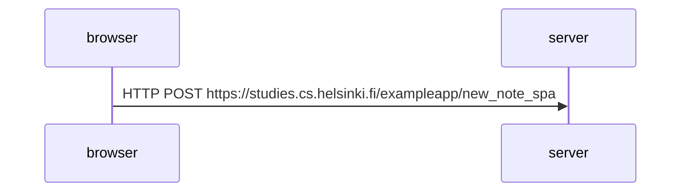

# fullstackopen_2022_submissions
My submissions to the fullstackopen course 2022

# Part 0 - exercise 0.4

```mermaid
sequenceDiagram
browser->>server: HTTP POST https://studies.cs.helsinki.fi/exampleapp/new_note
server-->>browser: Make new GET request to header url
browser->>server: HTTP GET https://studies.cs.helsinki.fi/exampleapp
server-->>browser: HTML-code
```
# Part 0 - exercise 0.5

```mermaid
sequenceDiagram
browser->>server: HTTP GET https://studies.cs.helsinki.fi/exampleapp/spa
server-->>browser: HTML-code
browser->>server: HTTP GET https://studies.cs.helsinki.fi/exampleapp/main.css
server-->>browser: main.css
browser->>server: HTTP GET https://studies.cs.helsinki.fi/exampleapp/spa.js
server-->>browser: spa.js
browser->>server: HTTP GET https://studies.cs.helsinki.fi/exampleapp/data.json
server-->>browser: data.json
```
# Part 0 - exercise 0.6

```mermaid
sequenceDiagram
browser->>server: HTTP POST https://studies.cs.helsinki.fi/exampleapp/new_note_spa
```
